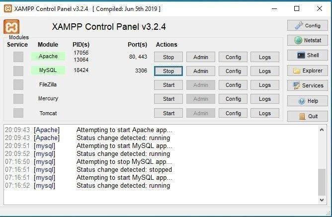

# Intro SQL Database 

1. Hari ini kita akan membahas materi SQL dan berkenalan dengan database.

2. Jika diperhatikan di XAMPP selain ada module Apache yang kita pakai untuk menjalankan server PHP, ada juga module MySQL untuk mengolah database.
  
  

  Ketika sudah dinyalakan module MySQL, klik tombol `Admin` pada panel xampp untuk membuka `localhost/phpmyadmin`.