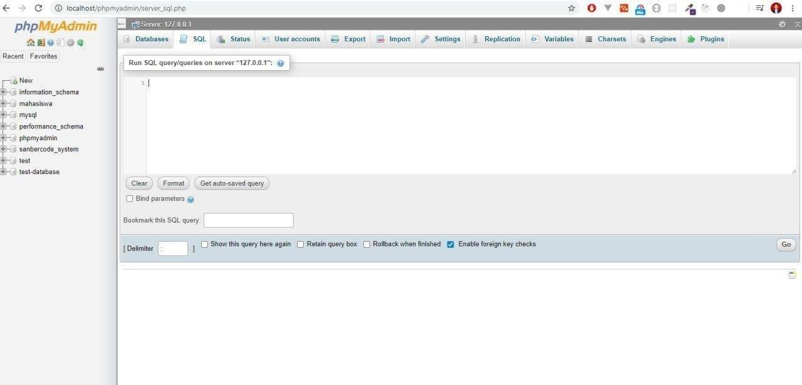

# Intro SQL Database 

1. Hari ini kita akan membahas materi SQL dan berkenalan dengan database.

    

2. Jika diperhatikan di XAMPP selain ada module Apache yang kita pakai untuk menjalankan server PHP, ada juga module MySQL untuk mengolah database.

    Ketika sudah dinyalakan module MySQL, klik tombol `Admin` pada panel xampp untuk membuka `localhost/phpmyadmin`.

3. Pada halaman phpmyadmin kita bisa membuat schema database baru, menambahkan tabel, mengisi data dan mengolah data di database.

4.  Walaupun sebenarnya di halaman phpmyadmin kita dapat dengan mudah mengolah database dengan tampilan yang disediakan seperti button-button, inputan dan lain lain, namun pada materi kali ini kita akan lebih belajar memberikan perintah SQL untuk mengolah database. Pada panel di halaman phpmyadmin klik panel dengan nama "SQL".  Dari situ kita bisa mulai membuat database, menambahkan tabel, memasukkan data, mencari data, dll.

    

5. Materi lebih lengkapnya bisa diikuti tutorial dari Sekolah Koding berikut:

    https://www.youtube.com/playlist?list=PLCZlgfAG0GXBWjBVQYxtx33htv6PqbKMl

6. Referensi Bacaan blog sanbercode:

    https://blog.sanbercode.com/docs/kurikulum-laravel-web-development/pekan-2-materi/hari-5-belajar-sql/

    password: `IMLaravelAgustus2020`

7. Selain menggunakan SQL di phpmyadmin, kita juga dapat menggunakan mysql xampp di command prompt. Untuk mengakses mysql  XAMPP di command prompt atau cmd dapat diikuti penjelasan dari Pak Sandhika Galih berikut ini:

    https://www.youtube.com/watch?v=fxe6qev-bno

8. Pengumpulan tugas menggunakan repositori baru di Gitlab. Link repositori nya dikumpulkan ke halaman dasbor sanbercode.com

    Deadline pengumpulan : Besok 10.00
    
    password : `IMLaravelAgustus2020`

9. Tugas hari ini dapat dibaca di dokumentasi blog sanbercode berikut:

    https://blog.sanbercode.com/docs/kurikulum-laravel-web-development/pekan-2-tugas-harian/hari-5-berlatih-sql/ 

    password : `IMLaravelAgustus2020`

# Record 

Livesession hari ke 5 pekan ke 2

https://www.youtube.com/watch?v=posIdmX9CIw&feature=youtu.be